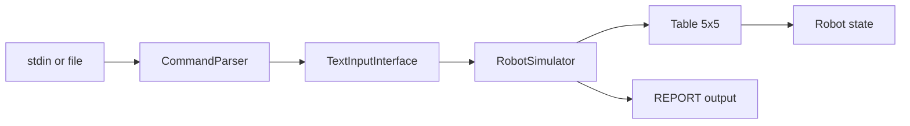

# java-toy-robot


Toy Robot Challenge — a Java 21 CLI that places and moves a robot on a 5×5 table.

## Quick start

### Run from stdin

```bash
mvn compile exec:java
```

Enter commands one per line ([Robot Challenge spec](https://github.com/luke-zhou/robot-challenge)). End input with a **blank line**.

```
PLACE 0,0,NORTH
MOVE
REPORT
```

Expected output: `0,1,NORTH`

Non-interactive example:

```bash
printf 'PLACE 0,0,NORTH\nMOVE\nREPORT\n\n' | mvn -q compile exec:java
```

### Run from a file

```bash
mvn compile exec:java -Dexec.args="commands.txt"
```

The file is read line-by-line until the first blank line (same rule as stdin). If no argument is given, the app reads from stdin.

### Run tests

```bash
mvn test
# Tests run: 77, Failures: 0, Errors: 0, Skipped: 0
```

## Architecture



| Layer | Package | Responsibility |
|-------|---------|----------------|
| CLI | `com.andywong.cli` | Parse command lines, read input, print `REPORT` |
| Application | `com.andywong.application` | Apply spec semantics (ignore invalid moves/placements) |
| Domain | `com.andywong.domain` | Table bounds, robot state, directions |

Main entry point: `com.andywong.cli.TextInputInterface`

## Refactor progress

Phases are tracked in [docs/REFACTOR_ROADMAP.md](docs/REFACTOR_ROADMAP.md). Summary:

| Phase | Focus | Status |
|-------|-------|--------|
| **1** | Build tooling, parsing, test isolation | **Done** — [PR #2](https://github.com/awongCM/java-toy-robot/pull/2) |
| **2** | Spec-aligned behavior, integration tests, file input | **Done** — [PRs #4–#6](https://github.com/awongCM/java-toy-robot/pull/6) |
| **3** | Clean architecture (no singletons, layered packages) | **Done** — [PRs #8–#12](https://github.com/awongCM/java-toy-robot/pull/12) |
| **4** | Polish (CI, edge-case tests, hardening) | **In progress** — [PRs #14+](https://github.com/awongCM/java-toy-robot/pull/14) |

### Phase 4 — Polish (in progress)

| Slice | Change |
|-------|--------|
| 4a | GitHub Actions CI (`mvn test` on push/PR) |
| 4b | Parameterized edge-case tests (edges, corners, re-`PLACE`) |
| 4d | README polish and CI badge |
| 4c | CLI parse exceptions and error-handling docs |

## Environment

- Java 21
- Maven 3.8+
- JUnit 5

## Documentation

- [Refactor roadmap](docs/REFACTOR_ROADMAP.md) — full phase plan and acceptance criteria
- [Historical notes](docs/HISTORICAL_NOTES.md) — pre–Phase 1 issues and root causes
- [AGENTS.md](AGENTS.md) — notes for cloud agents (stdin, main class, test count)
- [Robot Challenge spec](https://github.com/luke-zhou/robot-challenge) — official requirements
