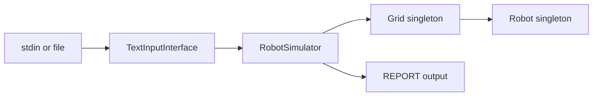
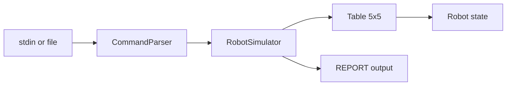

# Refactor Roadmap

This document tracks the planned refactor phases for the Toy Robot challenge. It covers what has been completed and what remains, so work can proceed incrementally without losing context.

For background on **why** Phase 1 was needed, see [HISTORICAL_NOTES.md](HISTORICAL_NOTES.md).

---

## Overview

| Phase | Focus | Status |
|-------|-------|--------|
| [Phase 1](#phase-1--quick-wins) | Build tooling, parsing, test isolation | **Done** |
| [Phase 2](#phase-2--spec-aligned-behavior) | Challenge spec compliance, integration tests, file input | **Done** |
| [Phase 3](#phase-3--clean-architecture) | Remove singletons, separate concerns, domain cleanup | **Next** |
| [Phase 4](#phase-4--polish) | Optional hardening, CI, edge-case coverage | Pending |

**Recommended order:** Phase 1 → Phase 2 → Phase 3 → Phase 4 (optional).

Phase 3 is the larger structural refactor. Spec behavior and integration tests are now locked in via Phase 2 — proceed with confidence.

---

## Phase 1 — Quick wins

**Status:** Done (PR [#2](https://github.com/awongCM/java-toy-robot/pull/2))

**Goal:** Make the project runnable, testable, and trustworthy from the command line without changing core domain behavior.

### Completed items

- [x] Fix `pom.xml` for **Java 21** with consistent compiler source/target
- [x] Remove duplicate JUnit 4 dependency; use **JUnit 5** with a pinned version
- [x] Configure **maven-surefire-plugin** so `mvn test` runs all tests (was 0 tests)
- [x] Add **exec-maven-plugin** for `mvn compile exec:java`
- [x] Fix `PLACE` parsing to accept comma-separated values (`0,0,NORTH`) with trim
- [x] Remove debug `System.out.println(commands)` from stdin loop
- [x] Fix CLI error message typo (`"something when wrong"`)
- [x] Add `resetForTesting()` helpers on `Grid`, `Robot`, and `TextInputInterface`
- [x] Reset captured stdout buffer in `TextInputInterfaceTest` between tests
- [x] Update `README.md` with Maven run/test instructions
- [x] Add [HISTORICAL_NOTES.md](HISTORICAL_NOTES.md) documenting pre-refactor failures

### Verification

```bash
mvn test
# Tests run: 39, Failures: 0, Errors: 0, Skipped: 0
```

---

## Phase 2 — Spec-aligned behavior

**Status:** Done (PRs [#4](https://github.com/awongCM/java-toy-robot/pull/4), [#5](https://github.com/awongCM/java-toy-robot/pull/5), [#6](https://github.com/awongCM/java-toy-robot/pull/6))

**Goal:** Align runtime behavior with the [Robot Challenge spec](https://github.com/luke-zhou/robot-challenge) and add confidence through integration tests and file input.

### Completed items

- [x] **Ignore commands before first valid `PLACE`**
  - `MOVE`, `LEFT`, `RIGHT`, and `REPORT` are no-ops until the robot is placed
  - Implemented via `RobotSimulator` — catches `IllegalStateException` from `Grid`

- [x] **Ignore moves that would fall off the table**
  - Invalid moves are silently ignored; robot position unchanged

- [x] **Ignore invalid `PLACE` commands**
  - Out-of-bounds placement is ignored (not thrown)
  - Valid `PLACE` after an invalid one still works
  - Parser-level malformed input still throws; out-of-bounds ignored by simulator

- [x] **Update tests** for spec-aligned behavior
  - `RobotSimulatorTest`, `RobotSimulatorIntegrationTest`, updated `TextInputInterfaceTest`
  - `GridTest` unchanged — domain layer still throws internally (bridge until Phase 3)

- [x] **Canonical integration tests** for the three official examples:

  | Input | Expected output |
  |-------|-----------------|
  | `PLACE 0,0,NORTH` → `MOVE` → `REPORT` | `0,1,NORTH` |
  | `PLACE 0,0,NORTH` → `LEFT` → `REPORT` | `0,0,WEST` |
  | `PLACE 1,2,EAST` → `MOVE` → `MOVE` → `LEFT` → `MOVE` → `REPORT` | `3,3,NORTH` |

- [x] **File-based input**
  - Read commands from a file path argument (e.g. `commands.txt`)
  - Fall back to stdin when no file is provided
  - Example: `mvn compile exec:java -Dexec.args="commands.txt"`

- [x] **`REPORT` when robot is not placed**
  - Silent no-op: `RobotSimulator.report()` returns empty; CLI prints nothing

### What Phase 2 delivered

- `com.andywong.application.RobotSimulator` — thin orchestrator enforcing spec semantics
- `TextInputInterface` wired through the simulator for all movement/placement commands
- File and stdin input paths with consistent blank-line termination

### Explicitly deferred to Phase 3

- Removing singletons (`Grid.getInstance()`, `Robot.getInstance()`)
- `resetForTesting()` workarounds
- Package restructure (`components/` → `domain/`, dedicated `cli/` parser)
- Domain cleanup (`Location` → `Position`, `int` coordinates, `hashCode`, injectable table size)
- `CommandParser` extraction and `Arrays.toString()` parameter round-trip removal

### Verification

```bash
mvn test
# Tests run: 56, Failures: 0, Errors: 0, Skipped: 0

mvn compile exec:java -Dexec.args="commands.txt"
# File input works; REPORT prints expected output
```

---

## Phase 3 — Clean architecture

**Status:** Pending — **next up**

**Goal:** Restructure the codebase for maintainability, testability, and interview/portfolio quality — without singletons or mixed responsibilities.

### Current state (before refactor)

| Area | Today | Target |
|------|-------|--------|
| Domain | `com.andywong.components` (`Grid`, `Robot`, `Location`, `Direction`) | `com.andywong.domain` (`Table`, `Robot`, `Position`, `Direction`) |
| Application | `RobotSimulator` depends on singleton `Grid` | `RobotSimulator` receives `Table` via constructor |
| CLI | `TextInputInterface` parses, prints, and orchestrates | `CommandParser` + thin `App` / `TextInputInterface` |
| Tests | `resetForTesting()` in `@BeforeEach` | Fresh instances per test, no static state |

### Suggested slices

Phase 3 can ship as incremental PRs (similar to Phase 2):

| Slice | Focus | Depends on |
|-------|-------|------------|
| **3a** | Remove singletons; constructor injection for `Table` + `Robot` | — |
| **3b** | Move classes to `domain/`, `application/`, `cli/` packages | 3a |
| **3c** | Domain cleanup (`Position`, `int` coords, `hashCode`, injectable table size) | 3b |
| **3d** | Extract `CommandParser`; remove `Arrays.toString()` round-trip | 3b |
| **3e** | Reorganize tests to mirror packages; remove `resetForTesting()` | 3a–3d |

Slices **3a** and **3d** can start in parallel once the injection points from 3a are defined. **3b** should land before **3c** and **3d**.

### Planned items

#### Remove singletons (slice 3a)

- [ ] Remove `Robot.getInstance()` and `Grid.getInstance()`
- [ ] Use constructor injection: `new Table(width, height, new Robot())`
- [ ] Remove `resetForTesting()` workarounds (no longer needed)
- [ ] Each test creates a fresh simulator/table instance

#### Separate concerns (slice 3b)

- [ ] **Domain layer** — pure logic, no I/O
  - `Direction` (enum)
  - `Position` (rename from `Location`)
  - `Robot` (state holder)
  - `Table` (rename from `Grid`; bounds + place/move/rotate)

- [ ] **Application layer** — command orchestration
  - `RobotSimulator` applies parsed commands and returns optional report output

- [ ] **CLI layer** — parsing and printing only
  - `Command` (enum)
  - `CommandParser` (string → typed command)
  - `App` / `TextInputInterface` (stdin or file input)

#### Domain cleanup (slice 3c)

- [ ] Rename `Location` → `Position`
- [ ] Use `int` for x/y instead of `Integer` (eliminate null-coordinate guards)
- [ ] Fix `Location.hashCode()` to match `equals()` (currently uses `super.hashCode()`)
- [ ] Make table size injectable/configurable (default 5×5)
- [ ] Remove awkward `Arrays.toString()` round-trip in command parameter handling (slice 3d)

#### Target package layout

```
com.andywong
├── domain/
│   ├── Direction.java
│   ├── Position.java
│   ├── Robot.java
│   └── Table.java
├── application/
│   └── RobotSimulator.java
├── cli/
│   ├── Command.java
│   ├── CommandParser.java
│   └── App.java
└── (tests mirror the above)
```

#### Test reorganization (slice 3e)

- [ ] Mirror package structure in test directory
- [ ] Unit tests for domain (no CLI dependencies)
- [ ] Integration tests for simulator + canonical examples
- [ ] Thin CLI smoke tests only

### Suggested approach

1. Introduce `Table` as a non-singleton alongside existing `Grid`, wire `RobotSimulator` to accept it via constructor, and migrate tests.
2. Delete singletons and `resetForTesting()` once all call sites use injection.
3. Move/rename packages in one focused PR to avoid half-old, half-new import paths lingering.
4. Run the Phase 2 integration tests after every slice — they are the behavior safety net.

### Acceptance criteria

- No static mutable singleton state
- Domain classes have zero imports from CLI or `System.out`
- All Phase 2 integration tests still pass
- `mvn test` green with improved test isolation (no `@BeforeEach` reset hacks)

---

## Phase 4 — Polish

**Status:** Pending (optional)

**Goal:** Harden the project for long-term maintenance and demonstration.

### Planned items

- [ ] **Custom exceptions** (only where fail-fast is genuinely desired)
  - Separate parsing errors from domain no-ops
  - Document which layer throws vs. ignores

- [ ] **Parameterized tests** for edge cases
  - All four table edges (north, south, east, west)
  - Corner positions
  - Multiple consecutive invalid moves
  - Re-`PLACE` mid-session

- [ ] **CI pipeline**
  - GitHub Actions (or similar) running `mvn test` on push/PR
  - Optionally: Java version matrix (21)

- [ ] **README polish**
  - Architecture diagram
  - Example file-input usage
  - Link to roadmap and historical notes

- [ ] **Code quality**
  - Remove dead code and commented-out blocks
  - Consistent naming (`Grid` → `Table` references in docs)
  - Consider records for `Position` (Java 21)

### Acceptance criteria

- CI badge or documented CI workflow
- Edge-case coverage beyond the three canonical examples
- README sufficient for a new developer to run, test, and understand the design

---

## Architecture

### Current (after Phase 2)



### Target (after Phase 3 and 4)



---

## Related documents

| Document | Purpose |
|----------|---------|
| [HISTORICAL_NOTES.md](HISTORICAL_NOTES.md) | Why the app failed before Phase 1 |
| [../README.md](../README.md) | How to run the app and tests today |
| [Robot Challenge spec](https://github.com/luke-zhou/robot-challenge) | Official challenge requirements |

---

## Notes for contributors

- **Prefer incremental PRs** — one phase (or a logical slice of a phase) per PR
- **Keep tests green** — run `mvn test` after every slice; Phase 2 integration tests are the behavior contract
- **Phase 2 is complete** — do not change spec semantics during Phase 3 unless intentional
- **Remove bridge code in Phase 3** — `resetForTesting()`, singletons, and `Grid` throwing internally should all go
- **Worktrees work well for Phase 3** — parallel slices (e.g. 3a singleton removal + 3d parser extraction) with sequential merge order
