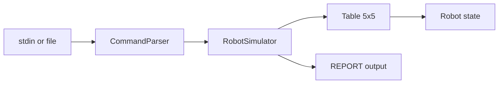

# Refactor Roadmap

This document tracks the planned refactor phases for the Toy Robot challenge. It covers what has been completed and what remains, so work can proceed incrementally without losing context.

For background on **why** Phase 1 was needed, see [HISTORICAL_NOTES.md](HISTORICAL_NOTES.md).

---

## Overview

| Phase | Focus | Status |
|-------|-------|--------|
| [Phase 1](#phase-1--quick-wins) | Build tooling, parsing, test isolation | **Done** |
| [Phase 2](#phase-2--spec-aligned-behavior) | Challenge spec compliance, integration tests, file input | Pending |
| [Phase 3](#phase-3--clean-architecture) | Remove singletons, separate concerns, domain cleanup | Pending |
| [Phase 4](#phase-4--polish) | Optional hardening, CI, edge-case coverage | Pending |

**Recommended order:** Phase 1 → Phase 2 → Phase 3 → Phase 4 (optional).

Phase 2 can ship independently of Phase 3. Phase 3 is the larger structural refactor and should follow once behavior is spec-correct and well tested.

---

## Phase 1 — Quick wins

**Status:** Done (PR [#2](https://github.com/awongCM/java-toy-robot/pull/2))

**Goal:** Make the project runnable, testable, and trustworthy from the command line without changing core domain behavior.

### Completed items

- [x] Fix `pom.xml` for **Java 21** with consistent compiler source/target
- [x] Remove duplicate JUnit 4 dependency; use **JUnit 5** with a pinned version
- [x] Configure **maven-surefire-plugin** so `mvn test` runs all tests (was 0 tests)
- [x] Add **exec-maven-plugin** for `mvn compile exec:java`
- [x] Fix `PLACE` parsing to accept comma-separated values (`0,0,NORTH`) with trim
- [x] Remove debug `System.out.println(commands)` from stdin loop
- [x] Fix CLI error message typo (`"something when wrong"`)
- [x] Add `resetForTesting()` helpers on `Grid`, `Robot`, and `TextInputInterface`
- [x] Reset captured stdout buffer in `TextInputInterfaceTest` between tests
- [x] Update `README.md` with Maven run/test instructions
- [x] Add [HISTORICAL_NOTES.md](HISTORICAL_NOTES.md) documenting pre-refactor failures

### Verification

```bash
mvn test
# Tests run: 39, Failures: 0, Errors: 0, Skipped: 0
```

### Explicitly deferred

Phase 1 intentionally did **not** change:

- Singleton architecture (`Grid.getInstance()`, `Robot.getInstance()`)
- Exception-throwing behavior for invalid moves or pre-`PLACE` commands
- File-based input
- Domain model cleanup (`Location`, `hashCode`, injectable table size)

---

## Phase 2 — Spec-aligned behavior

**Status:** In progress (slice 3c: file input — PR pending)

**Goal:** Align runtime behavior with the [Robot Challenge spec](https://github.com/luke-zhou/robot-challenge) and add confidence through integration tests and file input.

### Planned items

- [x] **Ignore commands before first valid `PLACE`** (slice 3a)
  - `MOVE`, `LEFT`, `RIGHT`, and `REPORT` should be no-ops until the robot is placed
  - Implemented via `RobotSimulator` — catches `IllegalStateException` from `Grid`

- [x] **Ignore moves that would fall off the table** (slice 3a)
  - Invalid moves should be silently ignored; robot position unchanged
  - Implemented via `RobotSimulator`

- [x] **Ignore invalid `PLACE` commands** (slice 3a)
  - Out-of-bounds or malformed placement should be ignored (not throw)
  - Valid `PLACE` after an invalid one should still work
  - Parser-level malformed input still throws; out-of-bounds ignored by simulator

- [x] **Update existing tests** to reflect spec-aligned behavior (slice 3a)
  - `RobotSimulatorTest` and updated `TextInputInterfaceTest`
  - `GridTest` unchanged — domain layer still throws internally

- [x] **Add canonical integration tests** for the three official examples (slice 3b):

  | Input | Expected output |
  |-------|-----------------|
  | `PLACE 0,0,NORTH` → `MOVE` → `REPORT` | `0,1,NORTH` |
  | `PLACE 0,0,NORTH` → `LEFT` → `REPORT` | `0,0,WEST` |
  | `PLACE 1,2,EAST` → `MOVE` → `MOVE` → `LEFT` → `MOVE` → `REPORT` | `3,3,NORTH` |

- [x] **Support file-based input** (slice 3c)
  - Read commands from a file path argument (e.g. `commands.txt`)
  - Fall back to stdin when no file is provided
  - Example: `mvn compile exec:java -Dexec.args="commands.txt"`

- [x] **Clarify `REPORT` when robot is not placed** (slice 3a)
  - Silent no-op: `RobotSimulator.report()` returns empty; CLI prints nothing

### Suggested approach

Introduce a thin **simulator/orchestrator** layer that interprets commands according to the spec, even if the underlying `Grid` methods still throw internally at first. This keeps Phase 2 changes localized before the Phase 3 structural refactor.

### Acceptance criteria

- All canonical examples pass
- `mvn test` green with updated behavior tests
- App runs against `commands.txt` and produces expected output
- No regressions in Phase 1 tooling (`mvn test`, `mvn compile exec:java`)

---

## Phase 3 — Clean architecture

**Status:** Pending

**Goal:** Restructure the codebase for maintainability, testability, and interview/portfolio quality — without singletons or mixed responsibilities.

### Planned items

#### Remove singletons

- [ ] Remove `Robot.getInstance()` and `Grid.getInstance()`
- [ ] Use constructor injection: `new Table(width, height, new Robot())`
- [ ] Remove `resetForTesting()` workarounds (no longer needed)
- [ ] Each test creates a fresh simulator/table instance

#### Separate concerns

- [ ] **Domain layer** — pure logic, no I/O
  - `Direction` (enum)
  - `Position` (rename from `Location`)
  - `Robot` (state holder)
  - `Table` (rename from `Grid`; bounds + place/move/rotate)

- [ ] **Application layer** — command orchestration
  - `RobotSimulator` applies parsed commands and returns optional report output

- [ ] **CLI layer** — parsing and printing only
  - `Command` (enum)
  - `CommandParser` (string → typed command)
  - `App` / `TextInputInterface` (stdin or file input)

#### Domain cleanup

- [ ] Rename `Location` → `Position`
- [ ] Use `int` for x/y instead of `Integer` (eliminate null-coordinate guards)
- [ ] Fix `Location.hashCode()` to match `equals()` (currently uses `super.hashCode()`)
- [ ] Make table size injectable/configurable (default 5×5)
- [ ] Remove awkward `Arrays.toString()` round-trip in command parameter handling

#### Target package layout

```
com.andywong
├── domain/
│   ├── Direction.java
│   ├── Position.java
│   ├── Robot.java
│   └── Table.java
├── application/
│   └── RobotSimulator.java
├── cli/
│   ├── Command.java
│   ├── CommandParser.java
│   └── App.java
└── (tests mirror the above)
```

#### Test reorganization

- [ ] Mirror package structure in test directory
- [ ] Unit tests for domain (no CLI dependencies)
- [ ] Integration tests for simulator + canonical examples
- [ ] Thin CLI smoke tests only

### Acceptance criteria

- No static mutable singleton state
- Domain classes have zero imports from CLI or `System.out`
- All Phase 2 integration tests still pass
- `mvn test` green with improved test isolation (no `@BeforeEach` reset hacks)

---

## Phase 4 — Polish

**Status:** Pending (optional)

**Goal:** Harden the project for long-term maintenance and demonstration.

### Planned items

- [ ] **Custom exceptions** (only where fail-fast is genuinely desired)
  - Separate parsing errors from domain no-ops
  - Document which layer throws vs. ignores

- [ ] **Parameterized tests** for edge cases
  - All four table edges (north, south, east, west)
  - Corner positions
  - Multiple consecutive invalid moves
  - Re-`PLACE` mid-session

- [ ] **CI pipeline**
  - GitHub Actions (or similar) running `mvn test` on push/PR
  - Optionally: Java version matrix (21)

- [ ] **README polish**
  - Architecture diagram
  - Example file-input usage
  - Link to roadmap and historical notes

- [ ] **Code quality**
  - Remove dead code and commented-out blocks
  - Consistent naming (`Grid` → `Table` references in docs)
  - Consider records for `Position` (Java 21)

### Acceptance criteria

- CI badge or documented CI workflow
- Edge-case coverage beyond the three canonical examples
- README sufficient for a new developer to run, test, and understand the design

---

## Architecture target (end state)

After Phase 3 and 4, the flow should look like this:



---

## Related documents

| Document | Purpose |
|----------|---------|
| [HISTORICAL_NOTES.md](HISTORICAL_NOTES.md) | Why the app failed before Phase 1 |
| [../README.md](../README.md) | How to run the app and tests today |
| [Robot Challenge spec](https://github.com/luke-zhou/robot-challenge) | Official challenge requirements |

---

## Notes for contributors

- **Prefer incremental PRs** — one phase (or a logical slice of a phase) per PR
- **Keep tests green** — update assertions when behavior intentionally changes (especially Phase 2)
- **Do not skip Phase 2** before Phase 3 unless you accept rework — spec behavior should be locked in before restructuring packages
- Phase 1's `resetForTesting()` helpers are a bridge; remove them in Phase 3 when singletons are gone
